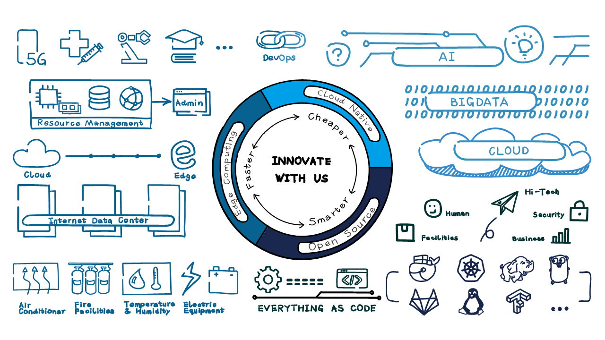

# smarthaven

With the evolution of cloud computing and cloud-native technologies, more and more services, larger cluster sizes, and more complex applications make data centers bigger and bigger. TPOS, PUE and server density pose great challenges to the management level of data centers. 

The "Smarthaven" is an important part of IDC's open source management projects, using cloud native, big data, and AI technology. We want to share:

## Features
* Collect and manage data, especially background audio information. The data is processed on the edge side.Saving 60% bandwidth and speed up 10 times. (Kubeedge/Kubernetes)
* Manage 1M+ sensors and 10TB+/day with Bigdata/IoT (Flink and Kubeedge)
* Perform edge detection fault alarm reasoning and prediction with AI. Saving 2%+ energy.(Kubeflow)
* Transmit and distribute AI models in 5 seconds. (Nats/Cefco)

## Architecture
[Architecture](docs/architecture.md) 

## Core Technologies
* [Cefco](cefco) 
* [Flink on Kubernetes](flinkonk8s)
* [Pytorch on Kubernetes](pytorchonk8s)
* [Promethus + Grafana](monitoring)
* [DevOps + GitOps](devgitops)

## Design Philosophy
* Opensource
* Everything as Code
* CRD
* Cloud Native
* Technology neutral and open
* DevOps (GitOps)

## Community
[Online Community Meeting (open)] (Coming soon.)  
[Online Community Meeting (VNET internal link)] (Coming soon.)  

## Contribution
Smarthaven is developed in the open, and is constantly being improved by our **users, contributors, and maintainers**. It is because of you that we can bring great software to the community.

If you are interested in contributing to smarthaven projects, please read this [Contribution Guide Document](CONTRIBUTING.md). 

## License
Copyright (c) <2021> <VNET Group>

Permission is hereby granted, free of charge, to any person obtaining a copy
of this software and associated documentation files (the "Smarthaven"), to deal
in the Software without restriction, including without limitation the rights
to use, copy, modify, merge, publish, distribute, sublicense, and/or sell
copies of the Software, and to permit persons to whom the Software is
furnished to do so, subject to the following conditions:

The above copyright notice and this permission notice shall be included in all
copies or substantial portions of the Software.

THE SOFTWARE IS PROVIDED "AS IS", WITHOUT WARRANTY OF ANY KIND, EXPRESS OR
IMPLIED, INCLUDING BUT NOT LIMITED TO THE WARRANTIES OF MERCHANTABILITY,
FITNESS FOR A PARTICULAR PURPOSE AND NONINFRINGEMENT. IN NO EVENT SHALL THE
AUTHORS OR COPYRIGHT HOLDERS BE LIABLE FOR ANY CLAIM, DAMAGES OR OTHER
LIABILITY, WHETHER IN AN ACTION OF CONTRACT, TORT OR OTHERWISE, ARISING FROM,
OUT OF OR IN CONNECTION WITH THE SOFTWARE OR THE USE OR OTHER DEALINGS IN THE
SOFTWARE.

## Partners
Inspur Software Co.

21vianet Blue Cloud

Tenxcloud

etc.

## Supporting Technologies
...(Coming soon.)

## About
...(Coming soon.)
