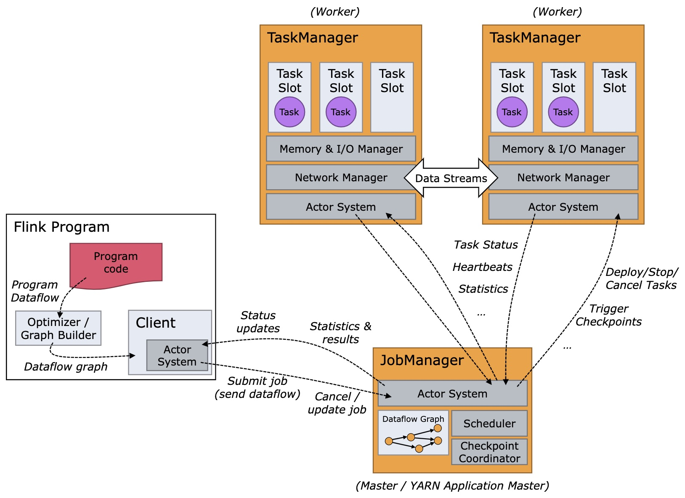
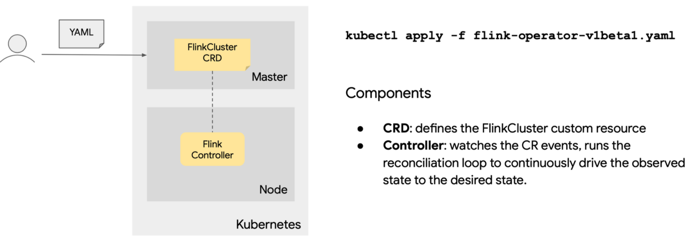

# Flink On Kubernetes

## Apache Flink 介绍
Apache Flink [https://flink.apache.org](https://flink.apache.org) 是一个开源流处理框架，具有强大的流和批处理能力。

### 核心特性
* 统一数据处理组件栈，处理不同类型的数据需求(Batch、Stream、ML、Graph）
* 支持事件时间(Event Time)，接入时间(Ingestion Time)，处理时间(Processing Time) 等时间概念
* 支持基于轻量级分布式快照(Snapshot)实现的容错
* 支持有状态计算
* 支持高度灵活的窗口(Window)操作
* 带反压的连续流模型
* 支持具有 BackPressure 功能的持续流模型
* 基于JVM 实现了独立的内存管理

## Flink 部署与应用
### Flink 集群架构


Flink 整个系统主要由两个组件组成，分别为 JobManager 和 TaskManager, Flink 架构也遵循 Master-Slave 架构设计原则，JobManager 为 Master 节点，TaskManager 为 Worker（Slave）节点。所有组件之间的通信都是借助于 Akka Framework，包括任务的状态以及 Checkpoint 触发等信息。

* **Client**
> 客户端负责将任务提交到集群，与 JobManager 构建 Akka 连接，然后将任务提交到 JobManager，通过和 JobManager 之间进行交互获取任务执行状态。客户端提交任务可以采用 CLI 方式或者通过使用 Flink WebUI 提交，也可以在应用程序中指定 JobManager 的 RPC 网络端口构建 ExecutionEnvironment 提交 Flink 应用。

* **JobManager**
> JobManager 负责整个 Flink 集群任务的调度以及资源的管理，从客户端中获取提交的应用，然后根据集群中 TaskManager 上 TaskSlot 的使用情况，为提交的应用分配相应的 TaskSlots 资源并命令 TaskManger 启动从客户端中获取的应用。JobManager 相当于整个集群的 Master 节点，且整个集群中有且仅有一个活跃的 JobManager，负责整个集群的任务管理和资源管理。JobManager 和 TaskManager 之间通过 Actor System 进行通信，获取任务执行的情况并通过 Actor System 将应用的任务执行情况发送给客户端。同时在任务执行过程中，JobManager 会触发 Checkpoints 操作，每个 TaskManager 节点收到 Checkpoint 触发指令后，完成 Checkpoint 操作，所有的 Checkpoint 协调过程都是在 JobManager 中完成。当任务完成后，Flink 会将任务执行的信息反馈给客户端，并且释放掉 TaskManager 中的资源以供下一次提交任务使用.

* **TaskManager**
> TaskManager 相当于整个集群的 Slave 节点，负责具体的任务执行和对应任务在每个节点上的资源申请与管理。客户端通过将编写好的 Flink 应用编译打包，提交到 JobManager，然后 JobManager 会根据已经注册在JobManager 中 TaskManager 的资源情况，将任务分配给有资源的 TaskManager 节点，然后启动并运行任务。TaskManager 从 JobManager 接收需要部署的任务，然后使用 Slot 资源启动 Task，建立数据接入的网络连接，接收数据并开始数据处理。同时 TaskManager 之间的数据交互都是通过数据流的方式进行的。

### Flink 集群部署模式
#### Session 模式


* JobManager 与 TaskManager 共享资源
* 客户端通过 RPC 或 REST API 连接集群的管理节点
* 需要上传依赖的jar包
* 需要生成 JobGraph 并提交到 JobManager
* JobManager 的生命周期不受提交的 Job 影响，会长期运行
> 优点
  * 资源充分共享，提升资源利用率
  * Job 直接在 Flink Session 集群中进行管理，运维简单

> 缺点
  * 资源隔离性较差
  * TM 不易扩展，Slot 计算资源伸缩性较差

#### Per-job 模式


* 每个 Job 独享 JobManager 与 TaskManager
* 需要上传依赖的jar包
* 需要生成 JobGraph，并提交到 JobManager
* JobManager 的生命周期与 Job 绑定
> 优点
  * 资源隔离充分
  * 资源根据 Job 需要进行申请，TM Slots 数量可以不同

> 缺点
  * 比较浪费资源，JobManager 需要消耗资源
  * Job 管理完全交给 ClusterManagement，管理复杂

#### Application 模式


* 每个 Application 对应一个 JobManager，且可以运行多个 Job
* 客户端无需将 Dependencies 传到 jobManager，仅负责管理 Job 的提交
* main（）方法运行在 JobManager 中，减轻了客户端的压力
* 有效降低带宽
* 实现 Application 级别的资源隔离

## Flink On Kubernetes 实践
### 安装Flink Operator插件


参考：[flink-on-k8s-operator](https://github.com/GoogleCloudPlatform/flink-on-k8s-operator)
```shell
├── deployment
│   └── flink-operator-controller-manager.yaml
├── rbac
│   ├── leader_election_role.yaml
│   ├── leader_election_role_binding.yaml
│   ├── role.yaml
│   └── role_binding.yaml
├── secret
│   └── webhook-server-cert.yaml
├── service
│   └── flink-operator-controller-manager-metrics-service.yaml
└── webhook
    ├── flink-operator-validating-webhook-configuration.yaml
    └── flink-operator-webhook-service.yaml
```


### 创建 Flink Session 集群
Session 集群的主要组件有：


```shell
apiVersion: flinkoperator.k8s.io/v1beta1
kind: FlinkCluster
metadata:
  name: flinksessioncluster-sample
spec:
  image:
    name: flink:1.8.2
    pullPolicy: Always
  jobManager:
    accessScope: Cluster
    securityContext:
      runAsUser: 9999
      runAsGroup: 9999
    ports:
      ui: 8081
    resources:
      limits:
        memory: "1024Mi"
        cpu: "200m"
  taskManager:
    replicas: 1
    resources:
      limits:
        memory: "1024Mi"
        cpu: "200m"
    volumes:
      - name: cache-volume
        emptyDir: {}
    volumeMounts:
      - mountPath: /cache
        name: cache-volume
    sidecars:
      - name: sidecar
        image: alpine
        command:
          - "sleep"
          - "10000"
  envVars:
    - name: FOO
      value: bar
  flinkProperties:
    taskmanager.numberOfTaskSlots: "1"
```


### 创建 Flink Per-job 集群
Per-job 集群的主要组件有：


```shell
apiVersion: flinkoperator.k8s.io/v1beta1
kind: FlinkCluster
metadata:
  name: flinkjobcluster-gcs
spec:
  image:
    name: flink:1.8.2
  jobManager:
    ports:
      ui: 8081
    resources:
      limits:
        memory: "1024Mi"
  taskManager:
    replicas: 2
    resources:
      limits:
        memory: "1024Mi"
  job:
    jarFile: /cache/wordcount.jar
    className: org.apache.flink.streaming.examples.wordcount.WordCount
    args: ["--input", "./README.txt"]
    parallelism: 2
    volumes:
      - name: cache-volume
        emptyDir: {}
    volumeMounts:
      - mountPath: /cache
        name: cache-volume
    initContainers:
      - name: gcs-downloader
        image: google/cloud-sdk
        command: ["gsutil"]
        args:
          - "cp"
          - "gs://my-bucket/wordcount.jar"
          - "/cache/wordcount.jar"
  gcpConfig:
    serviceAccount:
      secretName: "gcp-service-account"
      keyFile: "gcp_service_account_key.json"
      mountPath: "/etc/gcp_service_account/"
```


### 基于轻量级分布式快照（Snapshot）实现的容错
```shell
apiVersion: flinkoperator.k8s.io/v1beta1
kind: FlinkCluster
metadata:
  name: flinkjobcluster-savepoints
spec:
  image:
    name: flink:1.8.2
  jobManager:
    ...
  taskManager:
    ...
  job:
    autoSavePointSeconds: 300
    savepointsDir: gs://my-bucket/savepoints/
    restartPolicy: FromSavepointOnFailure
    ...
```
通过指定 autoSavepointSecondsand 和 savepointsDir 字段，operator 可以自动生成快照。而如果同时设置了 restartPolicy: FromSavepointOnFailure，当 job 异常退出后，operator 会从最近保存的 savepoint 那里进行自动重启。

## 参考
* [https://flink.apache.org/](https://flink.apache.org/)
* [https://github.com/GoogleCloudPlatform/flink-on-k8s-operator](https://github.com/GoogleCloudPlatform/flink-on-k8s-operator)

