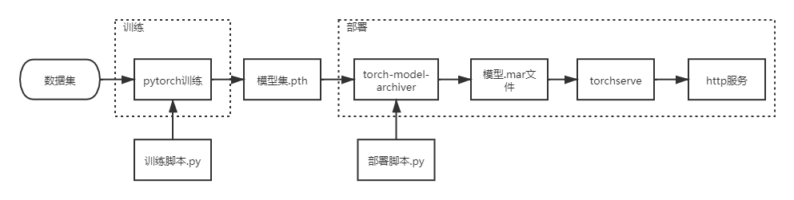

# PyTorch on Kubernetes

## 环境要求

以NVIDIA GPU为例。

### 官方的 NVIDIA GPU 设备插件

参考：[Kubernetes 文档 - 部署 NVIDIA GPU 设备插件](https://kubernetes.io/zh/docs/tasks/manage-gpus/scheduling-gpus/#deploying-nvidia-gpu-device-plugin)

官方的 NVIDIA GPU 设备插件 有以下要求:

- Kubernetes 的节点必须预先安装了 NVIDIA 驱动
- Kubernetes 的节点必须预先安装 nvidia-docker 2.0
- Docker 的默认运行时必须设置为 nvidia-container-runtime，而不是 runc
- NVIDIA 驱动版本 ~= 384.81

部署详细流程：[NVIDIA device plugin for Kubernetes](https://github.com/NVIDIA/k8s-device-plugin)

## PyTorch Operator

### 安装

[kubeflow/pytorch-operator](https://github.com/kubeflow/pytorch-operator)属于[Kubeflow](https://github.com/kubeflow)项目的一部分。Kubeflow官方文档要求通过kubeflow的部署工具来安装，不过在pytorch-operator的manifests目录中提供了部署需要的yaml文件，也可以直接手动部署。本文适用于0.6.0版本。

### 流程



### 训练

官方提供的镜像：`pytorch/pytorch:1.5-cuda10.1-cudnn7-runtime`

官方提供的镜像只包含了pytorch的库，通常需要在此镜像基础上继续构建加入pip包，常用的依赖参考：

```
tensorboardX==1.6.0
scikit-image
scikit-learn
pandas
numpy
scipy
matplotlib
pyyaml
nltk
```

按照官方示例，参考[Creating a PyTorch Job](https://github.com/kubeflow/pytorch-operator#creating-a-pytorch-job)，通过crd启动一个PyTorch的训练任务。

此处示例简化为单节点训练，只配置了Master节点，对于实际应用的场景需要考虑配置合适的Worker和backend。

```
apiVersion: "kubeflow.org/v1"
kind: "PyTorchJob"
metadata:
  name: "pytorch-train"
  namespace: kubeflow
spec:
  cleanPodPolicy: None
  pytorchReplicaSpecs:
    Master:
      replicas: 1
      restartPolicy: OnFailure
      template:
        spec:
          containers:
            - name: pytorch
              image: pytorch/pytorch:1.5-cuda10.1-cudnn7-runtime
              command:
              - sh
              - -c
              - python train.py --backend gloo
              volumeMounts:
              - mountPath: /work
                name: repository
              - mountPath: /dataset
                name: dataset
              - mountPath: /modelset
                name: modelset
          initContainers:
            - name: init-pytorch
              image: 192.168.2.193/system_containers/busybox:1.27.2
              command:
              - sh
              - -c
              - wget ftp://192.168.1.99/pytorch-train.tar.gz && tar xvf pytorch-train.tar.gz -C /work
              volumeMounts:
              - mountPath: /work
                name: repository
          volumes:
          - name: repository
            emptyDir: {}
          - name: dataset
            persistentVolumeClaim:
              claimName: dataset-testsd
          - name: modelset
            persistentVolumeClaim:
              claimName: modelset-testsd
---
apiVersion: v1
kind: PersistentVolumeClaim
metadata:
  name: dataset-testsd
  namespace: kubeflow
spec:
  accessModes: ["ReadOnlyMany"]
  resources:
    requests:
      storage: 5Gi
  selector:
    matchLabels:
      name: dataset-testsd
---
apiVersion: v1
kind: PersistentVolumeClaim
metadata:
  name: modelset-testsd
  namespace: kubeflow
spec:
  accessModes: ["ReadWriteOnce"]
  resources:
    requests:
      storage: 5Gi
  selector:
    matchLabels:
      name: modelset-testsd
---
apiVersion: v1
kind: PersistentVolume
metadata:
  name: dataset-testsd
  labels:
    name: dataset-testsd
spec:
  nfs:
    path: /sharedir/dataset/testsd
    server: 192.168.1.99
  accessModes: ["ReadOnlyMany"]
  capacity:
    storage: 5Gi
---
apiVersion: v1
kind: PersistentVolume
metadata:
  name: modelset-testsd
  labels:
    name: modelset-testsd
spec:
  nfs:
    path: /sharedir/modelset/testsd
    server: 192.168.1.99
  accessModes: ["ReadWriteOnce"]
  capacity:
    storage: 5Gi
```

### 模型打包

训练得到的pth二进制文件，就是训练的结果，不过文件只包含训练后的权重信息，无法独立提供推理的服务，还需要将模型打包。

参考[Torch Model archiver for TorchServe](https://github.com/pytorch/serve/blob/master/model-archiver/README.md)，提供了torch-model-archiver工具用于模型打包。连同模型定义、handler两个python文件，使用工具torch-model-archiver打包为mar格式的模型文件

### 模型部署

参考[TorchServe](https://github.com/pytorch/serve)，根据前一步打包获取mar格式的模型文件，使用torchserve部署http服务。

注意torchserve使用的镜像，同样需要重新构建安装依赖的pip包。

```
apiVersion: extensions/v1beta1
kind: Deployment
metadata:
  annotations:
    sidecar.istio.io/inject: "false"
  labels:
    name: pytorch-serve
  name: pytorch-serve
  namespace: kubeflow
spec:
  replicas: 1
  selector:
    matchLabels:
      name: pytorch-serve
  template:
    metadata:
      labels:
        name: pytorch-serve
    spec:
      containers:
      - image: pytorch/torchserve:0.1.1-cuda10.1-cudnn7-runtime
        command:
        - sh
        - -c
        - torchserve --start --models face_exp=face_exp.mar --ts-config /home/model-server/config.properties && tail -f /dev/null
        imagePullPolicy: Always
        name: pytorch-serve
        volumeMounts:
        - mountPath: /home/model-server/model-store
          name: modelset
        ports:
        - containerPort: 8080
          protocol: TCP
        - containerPort: 8081
          protocol: TCP
        resources:
          limits:
            cpu: "2"
            memory: 2Gi
          requests:
            cpu: 200m
            memory: 512Mi
      restartPolicy: Always
      volumes:
      - name: modelset
        persistentVolumeClaim:
          claimName: modelset-serve-testsd
      serviceAccountName: pytorch-operator
---
apiVersion: v1
kind: PersistentVolume
metadata:
  name: modelset-serve-testsd
  labels:
    name: modelset-serve-testsd
spec:
  nfs:
    path: /sharedir/modelset/testsd
    server: 192.168.1.99
  accessModes: ["ReadOnlyMany"]
  capacity:
    storage: 5Gi
---
apiVersion: v1
kind: PersistentVolumeClaim
metadata:
  name: modelset-serve-testsd
  namespace: kubeflow
spec:
  accessModes: ["ReadOnlyMany"]
  resources:
    requests:
      storage: 5Gi
  selector:
    matchLabels:
      name: modelset-serve-testsd
---
apiVersion: v1
kind: Service
metadata:
  annotations:
  labels:
    name: pytorch-serve
  name: pytorch-serve
  namespace: kubeflow
spec:
  ports:
  - name: pytorch-serve-0
    port: 8080
    protocol: TCP
    targetPort: 8080
  - name: pytorch-serve-1
    port: 8081
    protocol: TCP
    targetPort: 8081
  selector:
    name: pytorch-serve
  externalIPs:
    - 192.168.2.194
  sessionAffinity: None
  type: ClusterIP
status:
  loadBalancer: {}
```
